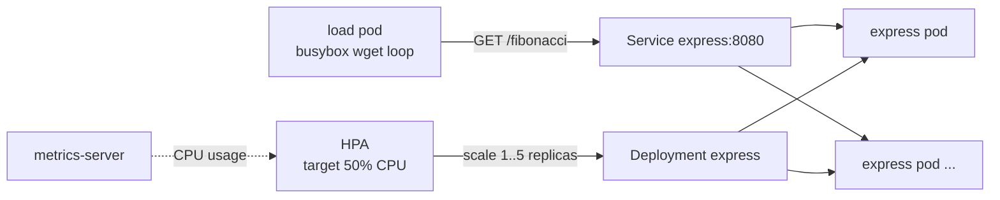

# kubernetes-adventure

A small hands-on experiment with the Kubernetes **Horizontal Pod Autoscaler
(HPA)** on a local [kind](https://kind.sigs.k8s.io) cluster.

A tiny Express API computes Fibonacci sequences to burn CPU. An HPA watches the
average CPU of the pods and scales the deployment between 1 and 5 replicas.

This is a learning project, based on
[Anton Putra's Kubernetes tutorials](https://github.com/antonputra/tutorials).
The deployment uses his published image, `aputrabay/express`.

## How it works



- Each pod requests `200m` CPU. The HPA target is 50% of that request, averaged
  across pods.
- `metrics-server` runs with `--kubelet-insecure-tls`, which kind needs because
  its kubelets use self-signed certificates.

## Requirements

- Docker
- [kind](https://kind.sigs.k8s.io/docs/user/quick-start/#installation)
- kubectl

## Running

```
make cluster      # create the kind cluster
make deploy       # metrics-server, deployment, HPA and a ClusterIP service
make metric-status
```

Wait until `metrics-server` is available, then start the load and watch the
HPA react:

```
make load         # busybox pod hammering /fibonacci?n=3000000
make watch-hpa
```

Output from a real run. The deployment went from 1 to 5 replicas in about 40
seconds:

```
NAME                    REFERENCE            TARGETS         MINPODS   MAXPODS   REPLICAS   AGE
fibonacci-express-hpa   Deployment/express   cpu: 0%/50%     1         5         1          79s
fibonacci-express-hpa   Deployment/express   cpu: 191%/50%   1         5         4          99s
fibonacci-express-hpa   Deployment/express   cpu: 92%/50%    1         5         5          119s
fibonacci-express-hpa   Deployment/express   cpu: 48%/50%    1         5         5          3m40s
```

Stop the load and the HPA scales back down after the default 5 minute
stabilization window:

```
make stop-load
```

To call the API yourself:

```
make expose-express
curl "localhost:8080/fibonacci?n=10"
```

Tear everything down:

```
make clean
```

## Layout

- `express/`: the API source and its Dockerfile. `server.js` defaults to port
  3000. The published image used by the deployment listens on 8080.
- `k8s/0-metric-server.yaml`: metrics-server v0.5.0, patched for kind.
- `k8s/1-deployment.yaml`: the Express deployment, with the CPU request the HPA
  relies on.
- `k8s/2-hpa.yaml`: the HPA, `autoscaling/v1`, 1 to 5 replicas at 50% CPU.
- `Makefile`: shortcuts for everything above.

## Takeaways

- The HPA cannot compute a CPU percentage without `resources.requests.cpu` on
  the container. No request, no autoscaling.
- The HPA depends on the metrics API, so `metrics-server` has to be healthy
  first. On kind that means `--kubelet-insecure-tls`.
- Scale up is fast, scale down is deliberately slow to avoid flapping.
